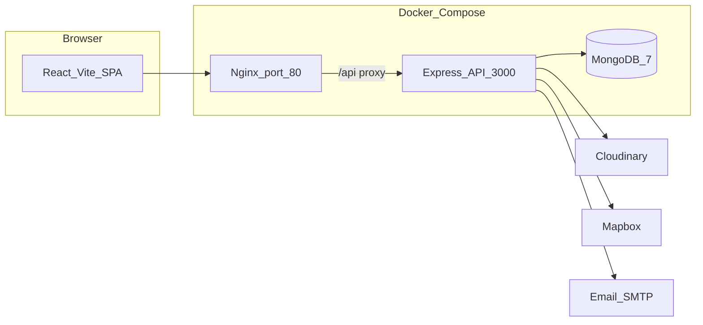

# Safar

A full-stack platform to discover, share, and review camping and travel experiences across India. Browse camps on an interactive map, publish your own spots with photos, leave reviews, save favorites, and manage everything from a modern React dashboard.

**Repository:** [github.com/Adhiraj170204/Safar](https://github.com/Adhiraj170204/Safar) (branch: [`Safar-react`](https://github.com/Adhiraj170204/Safar/tree/Safar-react))

-----

## Table of Contents

- [Features](#features)
- [Screenshots](#screenshots)
- [Tech Stack](#tech-stack)
- [Architecture](#architecture)
- [Project Structure](#project-structure)
- [Prerequisites](#prerequisites)
- [Local Development](#local-development)
- [Production (Docker)](#production-docker)
- [Environment Variables](#environment-variables)
- [API Reference](#api-reference)
- [Database Seeding](#database-seeding)
- [Security](#security)
- [Deployment](#deployment)
- [Contributing](#contributing)
- [License](#license)
- [Author](#author)

---

## Features

- **Browse & search** — List and map views with filters by tags, cost, and location
- **Camp management** — Create, edit, and delete camps with multi-image upload (Cloudinary)
- **Reviews & ratings** — Star ratings and written reviews per camp
- **Favorites** — Save camps to a personal favorites list
- **Authentication** — Sign up, email verification, JWT in HttpOnly cookies, refresh token rotation
- **Password recovery** — Forgot / reset password via email
- **User profiles** — Profile image, public profile pages, and camp history
- **Admin dashboard** — User, camp, and review moderation with role-based access
- **Dark mode** — Theme toggle across the UI
- **Maps** — Mapbox-powered map views and geocoding

---

## Screenshots

Add images to [`docs/screenshots/`](docs/screenshots/) and they will appear here.

| | |
|---|---|
|  | **Home** — Landing page |
|  | **Camp detail** — Photos, reviews, favorite |
|  | **Map view** — Browse camps geographically |
|  | **Admin** — Dashboard and moderation |

---

## Tech Stack

| Layer | Technologies |
|-------|----------------|
| **Frontend** | React 19, TypeScript, Vite 7, Tailwind CSS 4, React Router, Zustand, Mapbox GL, Radix UI |
| **Backend** | Node.js, Express 4, Mongoose, JWT, Zod, Multer, Cloudinary, Nodemailer |
| **Database** | MongoDB 7 |
| **DevOps** | Docker, Docker Compose, Nginx (production frontend) |

---

## Architecture



In **local development**, the Vite dev server (`:5173`) talks directly to the Express API (`:3000`). In **production**, Nginx serves the built SPA and proxies `/api` to the backend container.

---

## Project Structure

```
Safar/
├── backend/          # Express REST API
│   ├── src/
│   │   ├── routes/   # user, camp, review, admin, health
│   │   ├── models/
│   │   ├── utility/
│   │   └── seeds/
│   └── .env.example
├── frontend/         # React + Vite SPA
│   ├── src/
│   │   ├── pages/
│   │   ├── components/
│   │   └── api/
│   └── .env.example
├── docs/
│   └── screenshots/  # Add UI screenshots here
├── docker-compose.yml
└── .env.example      # Mapbox token for Docker frontend build
```

---

## Prerequisites

- **Node.js** 18+ (22 recommended for Docker images)
- **MongoDB** — local instance or [MongoDB Atlas](https://www.mongodb.com/atlas)
- **[Cloudinary](https://cloudinary.com)** — image storage
- **[Mapbox](https://account.mapbox.com/)** — maps and geocoding
- **SMTP** — e.g. Gmail with an App Password for verification and password-reset emails

---

## Local Development

### 1. Clone and enter the project

```bash
git clone -b Safar-react https://github.com/Adhiraj170204/Safar.git
cd Safar
```

### 2. Backend

```bash
cd backend
npm install
cp .env.example .env
# Edit .env — JWT secrets, MongoDB, Cloudinary, email, Mapbox
npm start
```

API runs at **http://localhost:3000**.

Optional — create an admin user:

```bash
npm run create:admin
```

### 3. Frontend

In a second terminal:

```bash
cd frontend
npm install
cp .env.example .env
```

Set in `frontend/.env`:

```env
VITE_MAPBOX_TOKEN=your_mapbox_token
VITE_API_BASE_URL=http://localhost:3000/api
```

```bash
npm run dev
```

App runs at **http://localhost:5173**.

---

## Production (Docker)

From the **repository root**:

1. Copy environment files and fill in real values:

   ```bash
   cp .env.example .env
   cp backend/.env.example backend/.env
   ```

   - Root `.env` — `VITE_MAPBOX_TOKEN` (used at frontend **build** time)
   - `backend/.env` — JWT, MongoDB, Cloudinary, email, `APP_BASE_URL`, etc.

2. Build and start:

   ```bash
   docker compose up --build -d
   ```

3. Open **http://localhost** — Nginx serves the SPA and proxies `/api` to the backend.

Health check: `GET /health` on the backend (internal port 3000).

---

## Environment Variables

### Root (Docker build)

| Variable | Description |
|----------|-------------|
| `VITE_MAPBOX_TOKEN` | Mapbox token baked into the frontend image |

See [`.env.example`](.env.example).

### Backend

| Variable | Description |
|----------|-------------|
| `JWT_ACCESS_SECRET` / `JWT_REFRESH_SECRET` | 64+ char random hex strings |
| `MONGODB_URI` | MongoDB connection string |
| `CLOUDINARY_*` | Cloud name, API key, secret |
| `EMAIL_*` | SMTP host, port, user, password |
| `APP_BASE_URL` | Frontend URL(s) for CORS and email links |
| `MAPBOX_TOKEN` | Server-side geocoding |
| `COOKIE_DOMAIN` | Cookie domain in production |

See [`backend/.env.example`](backend/.env.example).

Generate JWT secrets:

```bash
node -e "console.log(require('crypto').randomBytes(64).toString('hex'))"
```

### Frontend (local dev)

| Variable | Description |
|----------|-------------|
| `VITE_MAPBOX_TOKEN` | Mapbox public token |
| `VITE_API_BASE_URL` | `http://localhost:3000/api` (dev) or `/api` (Docker) |

See [`frontend/.env.example`](frontend/.env.example).

---

## API Reference

REST API base path: `/api`.

| Area | Prefix | Auth |
|------|--------|------|
| Health | `/health` | No |
| Users & auth | `/api/user` | Mixed |
| Camps | `/api/camp` | Mixed |
| Reviews | `/api/camp/:id/review` | Mixed |
| Admin | `/api/admin` | Admin only |

Full endpoint tables, models, and curl examples: **[backend/README.md](backend/README.md)**.

---

## Database Seeding

Run from `backend/`:

```bash
npm run create:admin    # Interactive admin creation
npm run seed:all        # Full dataset (users, camps, reviews)
```

---

## Security

- HttpOnly JWT cookies with refresh token rotation
- Helmet, CORS allowlist, rate limiting (stricter on auth routes)
- Zod validation and request sanitization
- Email verification required before login
- **Never commit** `.env` files, `cookies.txt`, or API keys
- Use HTTPS and `COOKIE_DOMAIN` matching your production domain

---

## Deployment

1. Host MongoDB (Atlas recommended) and set `MONGODB_URI`.
2. Set `APP_BASE_URL` to your public frontend URL (CORS and email links).
3. Configure Cloudinary and SMTP for production.
4. Build frontend with correct `VITE_*` variables (Docker handles this via compose args).
5. Put TLS termination in front of Nginx (e.g. reverse proxy or cloud load balancer).

For a split deploy (e.g. Railway + Vercel), run backend and frontend separately; set `VITE_API_BASE_URL` to your API URL and update backend CORS / `APP_BASE_URL`.

---

## Contributing

1. Fork the repository
2. Create a feature branch (`git checkout -b feature/your-feature`)
3. Commit your changes
4. Push and open a Pull Request

---

## License

ISC — see [backend/package.json](backend/package.json).

---

## Author

**Adhiraj Dubey** — [adhirajdubey17ad@gmail.com](mailto:adhirajdubey17ad@gmail.com)
