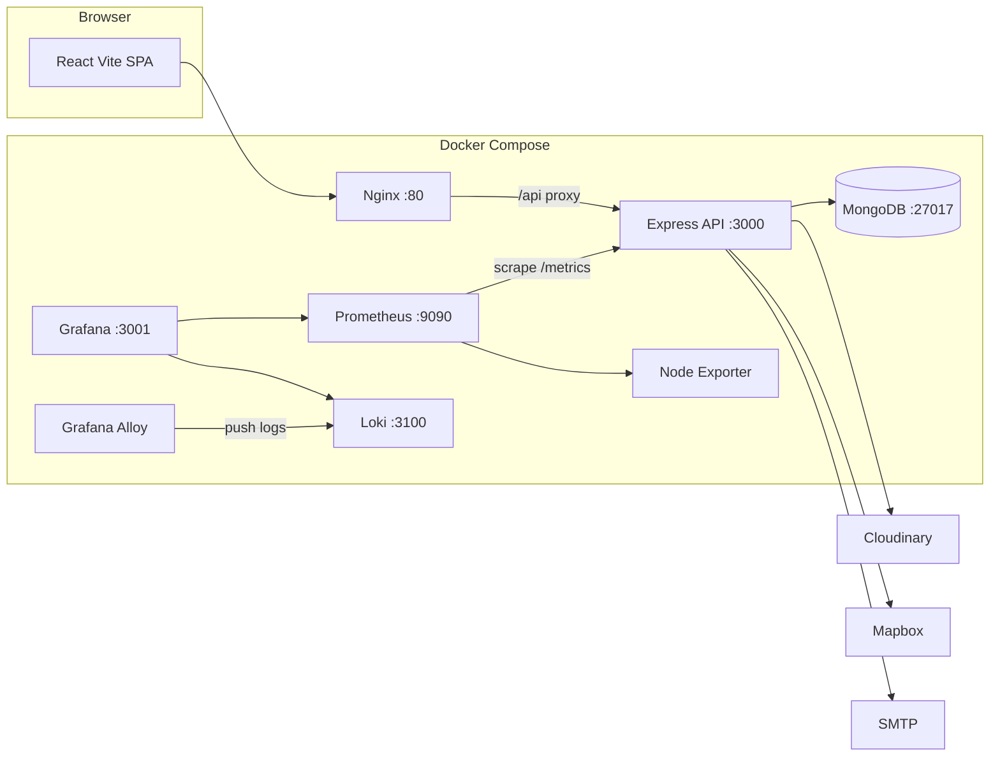

# Safar

A full-stack platform to discover, share, and review camping and travel experiences across India. Browse camps on an interactive map, publish your own spots with photos, leave reviews, save favorites, and manage everything from a modern React dashboard.

**Repository:** [github.com/Adhiraj170204/Safar](https://github.com/Adhiraj170204/Safar) (branch: [`Safar-react`](https://github.com/Adhiraj170204/Safar/tree/Safar-react))

---

## Table of Contents

- [Features](#features)
- [Tech Stack](#tech-stack)
- [Architecture](#architecture)
- [Project Structure](#project-structure)
- [Prerequisites](#prerequisites)
- [Local Development](#local-development)
- [Production (Docker)](#production-docker)
- [Environment Variables](#environment-variables)
- [Database Seeding](#database-seeding)
- [Monitoring](#monitoring)
- [CI/CD](#cicd)
- [Security](#security)
- [Author](#author)

---

## Features

- **Browse & search** — List and map views with filters by tags, cost, and location
- **Camp management** — Create, edit, and delete camps with multi-image upload (Cloudinary)
- **Reviews & ratings** — Star ratings and written reviews per camp
- **Favorites** — Save camps to a personal favorites list
- **Authentication** — Sign up, email verification, JWT in HttpOnly cookies, refresh token rotation
- **Password recovery** — Forgot / reset password via email
- **User profiles** — Profile image, public profile pages, and camp history
- **Admin dashboard** — User, camp, and review moderation with role-based access
- **Dark mode** — Theme toggle across the UI
- **Maps** — Mapbox-powered map views and geocoding

---

## Tech Stack

| Layer | Technologies |
| --- | --- |
| **Frontend** | React 19, TypeScript, Vite 7, Tailwind CSS 4, React Router, Zustand, Mapbox GL, Radix UI |
| **Backend** | Node.js, Express 4, Mongoose, JWT, Zod, Multer, Cloudinary, Nodemailer |
| **Database** | MongoDB 7 (authenticated) |
| **Infrastructure** | Docker, Docker Compose, Nginx |
| **Monitoring** | Prometheus, Grafana, Loki, Grafana Alloy, Node Exporter |
| **CI/CD** | GitHub Actions |

---

## Architecture



In **local development**, the Vite dev server (`:5173`) talks directly to the Express API (`:3000`). In **production**, Nginx serves the built SPA and proxies `/api` to the backend container.

---

## Project Structure

```
Safar/
├── .github/
│   └── workflows/
│       └── ci-cd.yml         # GitHub Actions — build + deploy on push
├── backend/
│   ├── src/
│   │   ├── routes/           # user, camp, review, admin, health
│   │   ├── models/
│   │   ├── utility/
│   │   │   └── metrics.js    # Prometheus instrumentation (prom-client)
│   │   └── seeds/
│   ├── docker-entrypoint.sh  # Runs seeds then starts server
│   └── Dockerfile
├── frontend/
│   ├── src/
│   │   ├── pages/
│   │   ├── components/
│   │   └── api/
│   └── Dockerfile
├── monitoring/
│   ├── prometheus.yml
│   ├── loki-config.yml
│   ├── alloy/
│   │   └── config.alloy
│   └── grafana/
│       ├── provisioning/     # Auto-configured datasources
│       └── dashboards/       # Pre-built Safar Overview dashboard
├── scripts/
│   └── deploy-ec2.sh         # Non-interactive fresh EC2 setup (gitignored)
├── docker-compose.yml        # Production stack
└── docker-compose.dev.yml    # Local dev stack
```

---

## Prerequisites

- **Node.js** 22
- **MongoDB** — local instance or [MongoDB Atlas](https://www.mongodb.com/atlas)
- **[Cloudinary](https://cloudinary.com)** — image storage
- **[Mapbox](https://account.mapbox.com/)** — maps and geocoding
- **SMTP** — e.g. Gmail with an App Password for verification and password-reset emails

---

## Local Development

### 1. Clone

```bash
git clone -b Safar-react https://github.com/Adhiraj170204/Safar.git
cd Safar
```

### 2. Backend

```bash
cd backend
npm install
cp .env.example .env
# Edit .env — JWT secrets, MongoDB, Cloudinary, email, Mapbox
npm start
```

API runs at `http://localhost:3000`.

### 3. Frontend

```bash
cd frontend
npm install
```

Set in `frontend/.env`:

```env
VITE_MAPBOX_TOKEN=your_mapbox_token
VITE_API_BASE_URL=http://localhost:3000/api
```

```bash
npm run dev
```

App runs at **http://localhost:5173**.

### 4. Docker (dev stack)

Alternatively, run everything with Docker:

```bash
docker compose -f docker-compose.dev.yml up --build
```

---

## Production (Docker)

### Fresh EC2 deployment

Upload the deploy script to the instance and run it (the script installs Docker, clones the repo, writes all env files, and starts the stack):

```bash
scp -i safar-key.pem scripts/deploy-ec2.sh ubuntu@<EC2-IP>:~/deploy-ec2.sh
ssh -i safar-key.pem ubuntu@<EC2-IP>
chmod +x ~/deploy-ec2.sh && bash ~/deploy-ec2.sh
```

### Manual / subsequent deploys

```bash
cd ~/safar
git pull origin Safar-react
sudo docker compose up --build -d
```

### EC2 security group — required open ports

| Port | Service |
| --- | --- |
| `80` | App (HTTP) |
| `22` | SSH |
| `3001` | Grafana (restrict to your IP) |
| `9090` | Prometheus (restrict to your IP) |

---

## Environment Variables

### Root `.env` (Docker Compose)

| Variable | Description |
| --- | --- |
| `VITE_MAPBOX_TOKEN` | Mapbox token baked into the frontend image at build time |
| `MONGO_PASSWORD` | MongoDB root password |
| `GRAFANA_PASSWORD` | Grafana admin password (default: `Admin@1234`) |

### Backend `.env`

| Variable | Description |
| --- | --- |
| `JWT_ACCESS_SECRET` / `JWT_REFRESH_SECRET` | 64+ char random hex strings |
| `MONGODB_URI` | Overridden by Docker Compose to include auth credentials |
| `CLOUDINARY_CLOUD_NAME` / `CLOUDINARY_API_KEY` / `CLOUDINARY_API_SECRET` | Cloudinary credentials |
| `EMAIL_HOST` / `EMAIL_PORT` / `EMAIL_USER` / `EMAIL_PASS` | SMTP config |
| `APP_BASE_URL` | Frontend origin(s) for CORS and email links |
| `MAPBOX_TOKEN` | Server-side geocoding |
| `COOKIE_SECURE` | `true` in production (HTTPS), `false` for HTTP |

Generate JWT secrets:

```bash
node -e "console.log(require('crypto').randomBytes(64).toString('hex'))"
```

---

## Database Seeding

Seeds run automatically on container startup (skipped if data already exists).

Manual commands on EC2:

```bash
# Seed camp/user data
sudo docker compose exec backend node src/seeds/seedData.js

# Force re-seed (wipes existing data)
sudo docker compose exec backend node src/seeds/seedData.js --force

# Create admin user (interactive)
sudo docker compose exec backend node src/seeds/createAdmin.js
```

---

## Monitoring

The production stack includes a full observability setup accessible from the EC2 instance.

| Service | URL | Credentials |
| --- | --- | --- |
| **Grafana** | `http://<EC2-IP>:3001` | `admin / <GRAFANA_PASSWORD>` |
| **Prometheus** | `http://<EC2-IP>:9090` | — |

**Grafana → Dashboards → Safar → Safar Overview** shows:

- HTTP request rate and error rate by route
- P95 response time
- MongoDB connection status
- CPU, memory, and disk gauges
- Live container logs (via Loki)

**Prometheus scrape targets:** Prometheus self, `safar-backend` (`/metrics`), `node-exporter` (system).

---

## CI/CD

Every push to `Safar-react` triggers the GitHub Actions workflow (`.github/workflows/ci-cd.yml`):

1. **CI** — installs backend deps, installs frontend deps, builds the frontend
2. **Deploy** — SSHs into EC2, runs `git pull && docker compose up --build -d`

Required GitHub repository secrets:

| Secret | Value |
| --- | --- |
| `EC2_HOST` | EC2 public IP |
| `EC2_USER` | `ubuntu` |
| `EC2_SSH_KEY` | Contents of `safar-key.pem` |
| `VITE_MAPBOX_TOKEN` | Mapbox token (for CI frontend build) |

---

## Security

- HttpOnly JWT cookies with refresh token rotation
- MongoDB requires authentication (`admin` user, `authSource=admin`)
- Helmet headers, CORS allowlist, rate limiting (stricter on auth routes)
- Zod validation and NoSQL-injection / XSS sanitization on all requests
- Email verification required before login
- `/metrics` endpoint is internal-only (not proxied by Nginx)
- `.env` files, `safar-key.pem`, and `deploy-ec2.sh` are gitignored

---

## Author

**Adhiraj Dubey** — [adhirajdubey17ad@gmail.com](mailto:adhirajdubey17ad@gmail.com)
